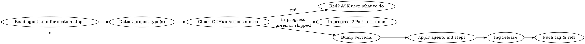

# Releasing

Automated multi-language version bumping with GitHub Actions verification.

## When to Use

- User says "release", "bump version", "publish vX.Y.Z", or similar release intent
- Semver level is provided: `major`, `minor`, or `patch`
- The project has a git repository (required)

**Don't use when:**
- No semver level specified — ask the user first
- Not in a git repository
- The user wants to dry-run only (skip auto-tag/push, just show what would change)

## Flowchart



## Step 1 — Read `agents.md`

Look for `.agents/agents.md` in the project root. If it exists, read it fully. Extract any release-related instructions (e.g., "run tests before releasing", "update CHANGELOG.md", "notify Slack"). These are **additional steps** to apply after bumping but before tagging.

## Step 2 — Detect Project Type(s)

Scan the repository root for these files (check all that exist):

| File | Language / Ecosystem | Version field location |
|------|---------------------|----------------------|
| `Cargo.toml` | Rust | `version = "x.y.z"` |
| `go.mod` | Go | Module path contains version suffix (e.g. `/v2`) — bump in build script or separate version file if used |
| `pom.xml` | Java (Maven) | `<version>x.y.z</version>` |
| `build.gradle` or `build.gradle.kts` | Java/Kotlin (Gradle) | `version = "x.y.z"` |
| `package.json` | Node.js / TypeScript | `"version": "x.y.z"` |
| `pyproject.toml` | Python (PEP 621) | `version = "x.y.z"` |
| `setup.py` | Python (legacy) | `version="x.y.z"` in `setup()` |
| `setup.cfg` | Python (legacy) | `version = x.y.z` under `[metadata]` |
| `*.gemspec` | Ruby | `spec.version = "x.y.z"` |
| `CMakeLists.txt` | C/C++ (CMake) | `project(... VERSION x.y.z)` |
| `*.csproj` | .NET | `<Version>x.y.z</Version>` or `<PackageVersion>` |

**Multiple ecosystems?** Bump versions in **all** detected files. Use the same semver string for all.

## Step 3 — Check GitHub Actions Status

### If `gh` CLI is available and authenticated:

```bash
# Get latest workflow run for the default branch
gh run list --limit 1 --json status,conclusion,name,headBranch --workflow main.yml 2>/dev/null || \
gh run list --limit 1 --json status,conclusion,name,headBranch 2>/dev/null
```

If no workflow runs exist yet, **skip this check** and proceed.

### Polling logic:

| Status | Action |
|--------|--------|
| `completed` + `conclusion: success` | ✅ Proceed to bump |
| `completed` + `conclusion: failure` | ❌ Find out why (run `gh run view <id> --log-failed`) and **ASK** the user what to do — include option to fix and re-check, or skip CI check |
| `in_progress` or `queued` | ⏳ Sleep 15s, poll again. Repeat until completed |

If `gh` is not available or not authenticated, print a warning and proceed (don't block).

## Step 4 — Bump Versions

Parse the current version from each file, compute the new version, and write it back.

**Version parsing rules:**
- Extract `x.y.z` (or `v` prefix) from the version field
- Validate it matches semver (at minimum: three numeric parts separated by dots)
- Increment the appropriate part: major, minor, or patch
- Reset lower parts to 0 (major bump: x.0.0; minor bump: x.y.0)

**File-specific edit rules:**

### Cargo.toml
```toml
# Before
version = "1.2.3"
# After
version = "1.3.0"
```

### pom.xml
```xml
<!-- Before -->
<version>1.2.3</version>
<!-- After -->
<version>1.3.0</version>
```

### build.gradle / build.gradle.kts
```kotlin
// Before
version = "1.2.3"
// After
version = "1.3.0"
```

### package.json
```json
{
  // Before
  "version": "1.2.3",
  // After
  "version": "1.3.0"
}
```

### pyproject.toml
```toml
# Before
version = "1.2.3"
# After
version = "1.3.0"
```

### setup.py
```python
# Before
setup(version="1.2.3")
# After
setup(version="1.3.0")
```

### CMakeLists.txt
```cmake
# Before
project(mylib VERSION 1.2.3)
# After
project(mylib VERSION 1.3.0)
```

### *.csproj
```xml
<!-- Before -->
<Version>1.2.3</Version>
<!-- After -->
<Version>1.3.0</Version>
```

**Important:** Only bump the version field — don't modify other content. If a file has multiple `version` fields (e.g., workspace Cargo.toml), bump the top-level one.

## Step 5 — Apply `agents.md` Steps

Execute any custom release steps extracted in Step 1 (in order).

## Step 6 — Tag and Push

```bash
TAG="v<new_version>"   # e.g. v1.3.0
git tag -a "$TAG" -m "Release $TAG"
git push origin "$TAG"
# If there are uncommitted version changes, commit and push those too:
git add .
git commit -m "chore: bump version to $TAG"
git push
```

## Common Mistakes

| Mistake | Fix |
|---------|-----|
| Skipping GitHub Actions check | Always check — a red build means don't release |
| Bumping only one file when multiple exist | Detect ALL ecosystem files and bump all |
| Not reading `agents.md` before releasing | It may contain required custom steps |
| Creating tag without `-a` (annotated) | Use `git tag -a` for proper releases |
| Forgetting to push the tag after pushing commits | Push both: `git push origin "$TAG"` then `git push` |

## Verification

After releasing, confirm:
1. Tag exists on remote: `git ls-remote --tags origin \| grep <version>`
2. No uncommitted version changes remain
